# VMware 위에서 'Market_DApp' 개발 후 <br> AWS Blockchain Ethereum Network에 배포하기

<p align= "center">
</p> 
Truffle Framework와 Ganache(Virtual Ethereum-RPC)를 사용하여 Smart Contract 구현 및 테스트 배포를 진행하며 최종적으로 AWS Blockchain 네트워크를 생성 및 이관을 목표로 한다.

## Part 0. 개요

### * 프로젝트 소개

저희가 개발하고 있는 SW는 이더리움 플랫폼 위에서 마켓 시스템을 구현한 탈중앙화 분산 애플리케이션인 DApp입니다. 
블록체인 기술 중 하나인 스마트 컨트랙을 이용하고자 하며 스마트 컨트랙의 장점을 극대화할 수 있도록 마켓 시스템에 도입하고자 합니다.
저희가 개발하는 DApp의 장점은 탈중앙화이며 이를 스마트 컨트랙의 기술로 활용하기 때문에 중개인 비용이 절감되고 거래 수수료가 현저히 감소하는 효과를 기대할 수 있습니다. 또한 투명한 거래 내역이 공개되므로 위변조가 어렵다는 점에서 보안 유지 효과를 기대할 수 있습니다.
또한 저희의 최종 결과물은 개발한 DApp을 배포하는 운영환경을 이더리움 테스트 네트워크(Ganache)에서 AWS 이더리움 프라이빗 블록체인 네트워크를 구축한 후 마이그레이션하는 것이 목표입니다.

>간단한 다이어그램
>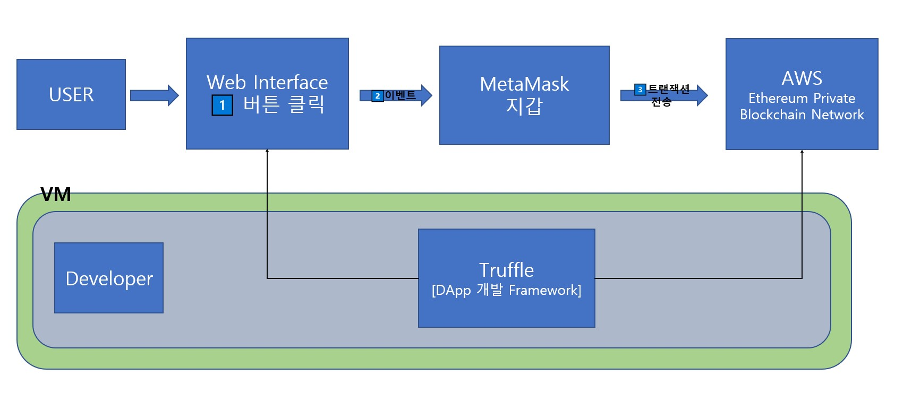

### * 멤버 이름 및 파트 소개  
 - 20175257 스마트IoT학과 조우형 
 > 오픈소스 자료 활용 / Dapp 개발 및 테스트 / AWS Ethereum Blockchain 네트워크 구축 및 이관  
 - 20175240 스마트IoT학과 이선재
 > Github 관리 / Dapp 개발 및 테스트 / AWS Ethereum Blockchain 네트워크 구축 및 이관


### * 목차
 - 개발 환경설정  
 - Smart Contract 생성 / 배포 / 테스트  
 - 인터페이스 개발 및 DApp 구동  
 - AWS Ethereum BlockChain Network Template 구축 
 - AWS Ethereum 네트워크에 DApp 이관 및 구동  

&nbsp;&nbsp;
## 1. 개발 환경
### 1.1 Version
- VM : ubuntu-20.04.3-desktop-amd64.iso
- NPM : v8.1.4
- Truffle : v4.1.13 (core: 4.1.13)
- Solidity : v0.4.24 (solc-js)
- Web3 : v1.5.3
- Node : v17.2.0
- Ganache : 1.1.0
- Metamask : latest version

### 1.2 프로젝트를 진행할 디렉토리를 생성
```
$ mkdir Market_DApp  
$ cd Market_DApp
```
### 1.3 Truffle framework unboxing
```
$ truffle unbox pet-shop
```
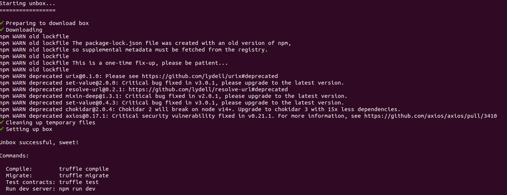

Box에는 Truffle에서 제공해주는 Framework는 DApp을 개발하는데 다양한 모듈이 담겨있다.

### 1.4 Box에서 불필요 파일 삭제
명령어 입력
```
$ rm box-img-lg.png
$ rm box-img-sm.png
$ rm -rf src/images/*.jpeg
$ rm src/pets.json
```
## 2. SmartContract 생성 / 배포 / 테스트
### 2.1 Smart Contract 작성
```
$ nano contracts/LeaseProperty.sol
```
.PNG)

### 2.2 Smart Contract 컴파일
```
$ truffle compile
```
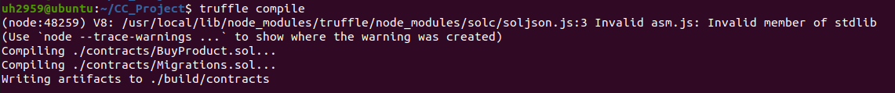

### 2.3 마이그레이션 코드 작성
```
$ nano migrations/2_deploy_contracts.js
```
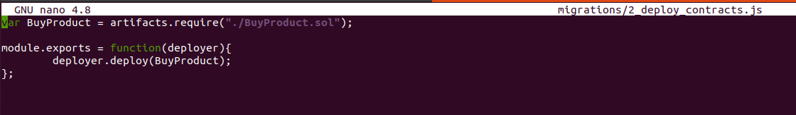

### 2.4 Ganache 실행 및 설정
>Setting -> SERVER 속 PORT Number를 8545로 지정해주고 RESTART 클릭
### 2.5 Ganache 와 연결
```
$ truffle migrate
```
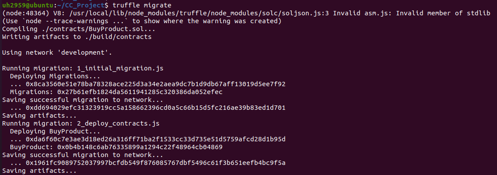
>연결 후 Ganache CURRENT BLOCK 개수 변동 (0 -> 4)  
>트렌잭션 수수료로 인하여 첫 번째 블럭의 BALANCE 감소
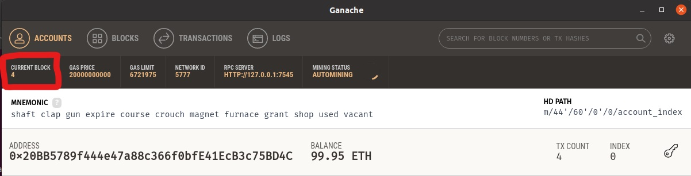
### 2.6 Test 파일 생성
```
$ nano test/TestLeaseProperty.sol
```
.PNG)

### 2.7 Test 파일 실행
```
$ truffle test
```
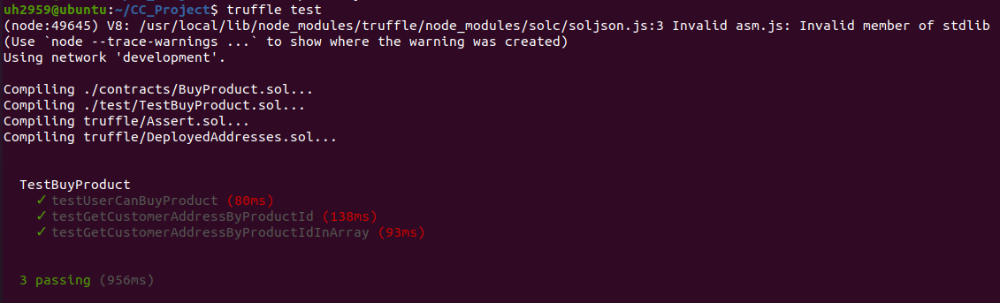  

## 3. 인터페이스 및 DApp 
### 3.1 app.js 파일 수정
```
$ nano src/js/app.js
```
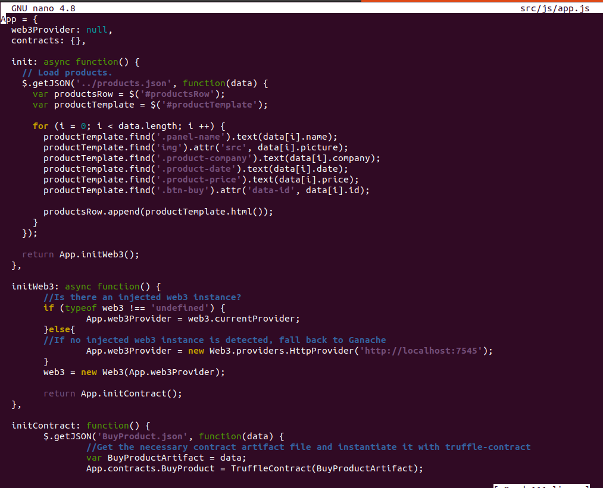
### 3.2 index.html 파일 수정
```
$ nano src/index.html
```


### 3.2 properties.json 파일 수정
```
$ nano src/properties.json
```
>AWS Bucket을 사용하여 로컬환경 DApp에서 이미지 확인 가능  

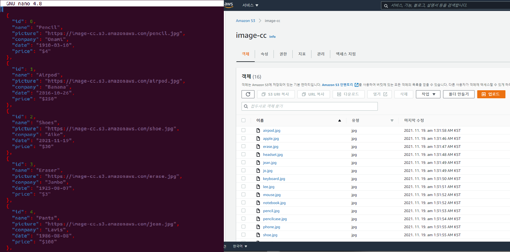

### 3.3 MetaMask (Chrome)
- [MetaMask][MetaMask] 설치
- Network : Localhost 8545
- MNEMONIC 연결 (ganache <-> MetaMask)
> 마이그레이션을 통한 블록체인 상태가 변한 가나슈와 MetaMask를 연결  
> 연결완료 시, MetaMask 지갑에서 속 값이 Ganache의 블록체인 값과 같음을 볼 수 있다

### 3.4 DApp 구동
```
$ npm run dev
```
   
- 메인화면  
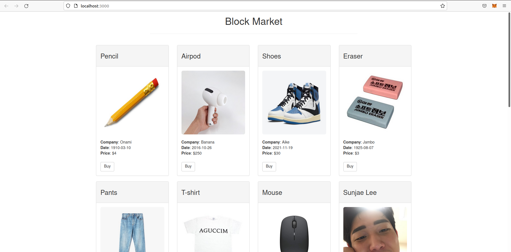
- MetaMask 정상 연결 성공
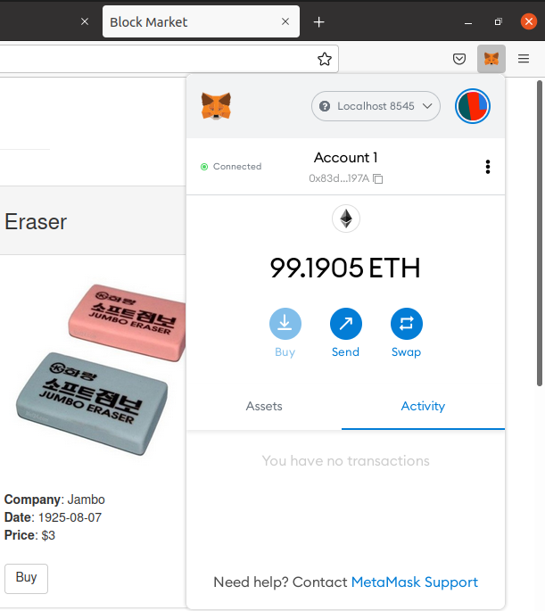
- 구매  
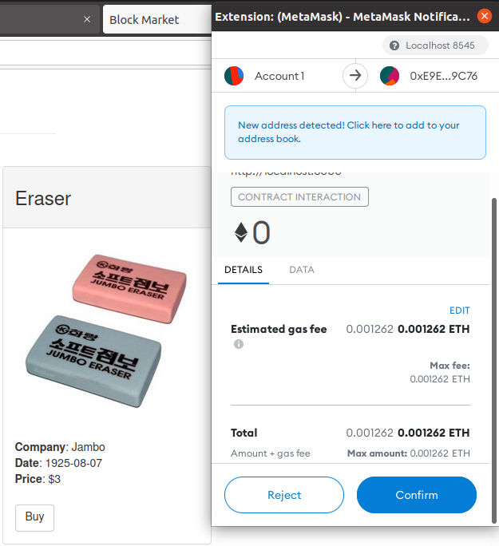
- 구매완료  
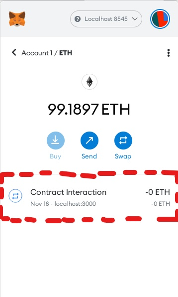
>DApp이 구동되고 MetaMask 연결되면 거래 가능
>이력을 보면 트랜잭션을 정상 승인되었음을 알 수 있다.


[MetaMask]: https://chrome.google.com/webstore/detail/metamask/nkbihfbeogaeaoehlefnkodbefgpgknn?hl=ko

## 4 AWS Ethereum BlockChain Network Template 구축
### 4.1 사전 준비
- AWS계정 로그인
- IAM User 생성
- Key Pair 생성

### 4.2 탄력적 IP Address 생성
> https://console.aws.amazon.com/vpc/

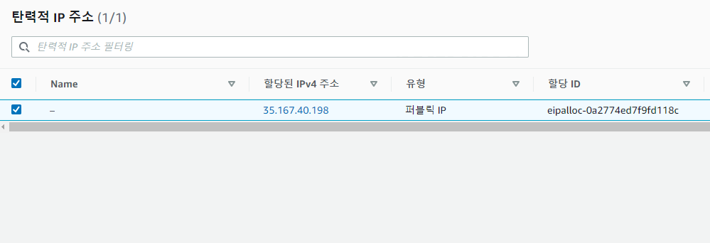

### 4.3 VPC 생성
> EthereumVPC [VPC] : Virtual Private Cloud
>> Private Network를 구축할 수 있도록 해주는 AWS 도구

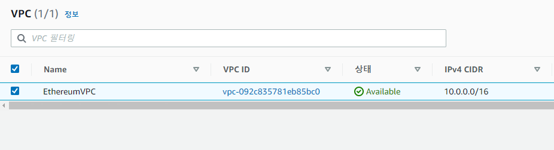

### 4.4 Subnet 생성
> EthereumPubSub1, EthereumPubSub2
>> [Public Subnet] : 자신의 고유 IP외에 탄력적 IP를 별도록 가지고 있고, 이 IP를 통해 인터넷과 연결 가능하다.

> EthereumPvtSub
>> [Private Subnet] : 자신의 고유 IP만을 가지고 있고, 외부 인터넷과 연결은 불가능하며 Subnet끼리만 트래픽 전송 가능하다.


### 4.5 Security Group 생성
> https://console.aws.amazon.com/ec2/

> 보안 그룹은 방화벽 역활을 하면서 리소스에 대한 인바운드 및 아웃바운드 트래픽을 제어한다.


***
> ✔︎ EthereumEC2_SG
>> [EC2 인스턴스용 보안 그룹] : EC2 인스턴스에 대한 트래픽 제어

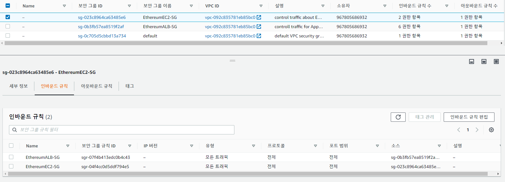
***
> ✔︎ EthereumALB_SG
>> [Application Load Balancer용 보안 그룹] : Application Load Balancer, EC2 인스턴스 및 접속 호스트 간의 트래픽을 제어한다.

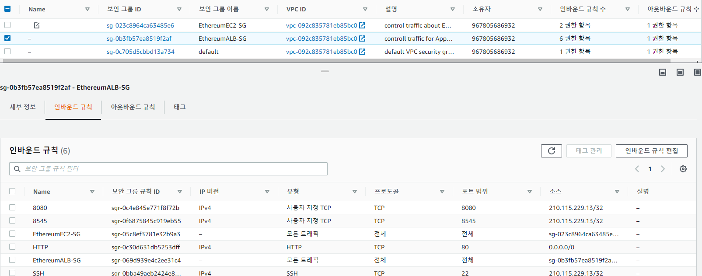

### 4.6 IAM 역활 생성
> https://console.aws.amazon.com/iam/

> Amazon ECS에 대한 IAM 역활과 EC2 인스턴스 프로파일을 지정하여 연결된 권한 정책을 사용하면 AWS리소스 및 인스턴스가 다른 AWS 리소스와 상호 작용할 수 있다.

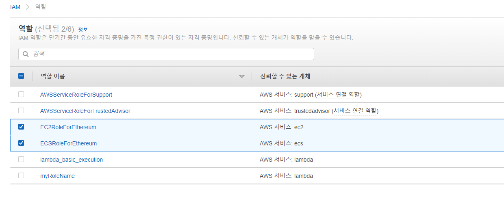

### 4.7 접속 호스트 생성
> Ethereum 네트워크에서 웹 인터페이스 및 인스턴스에 연결하는 데 사용하는 EC2 인스턴스이며 일종의 보안을 위해 침입 차단 소프트웨어가 설치가 되어 내부와 외부 네트워크 사이에서 일종의 게이트 역활을 수행하는 호스트이다.

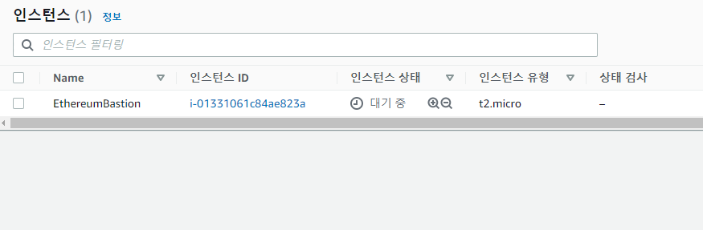

### 4.8 Ethereum 네트워크 생성
> https://aws.amazon.com/ko/blockchain/templates/getting-started/

> 위 링크에서 최신 Ethereum용 AWS 블록체인 템플릿을 AWS CloudFormation 콘솔에 연결한다.

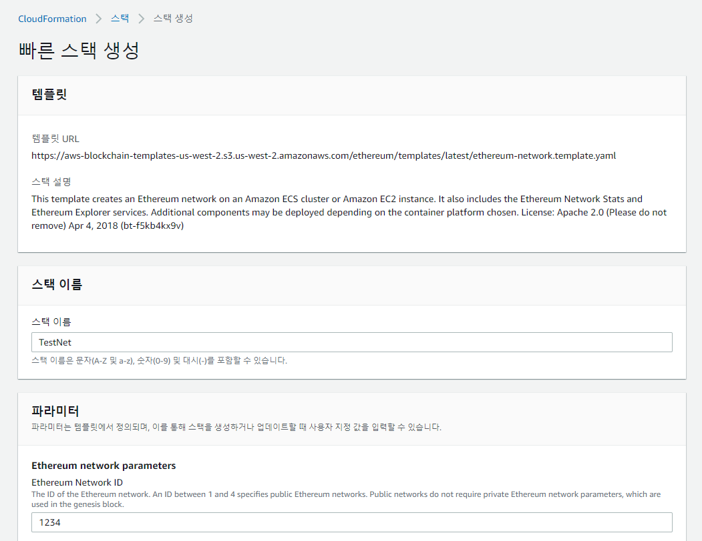

> ✔︎ 이를 통해 Ethereum 네트워크 생성을 완료한 것을 확인할 수 있다.


### 4.9 이더리움 네트워크에 접속하기

#### &#127873; Bastion Host를 이용하여 접속하기
```
$ ssh -i /ex-key-pair.pem ec2-user@bastion-host-dns -D 9001
```
> 위의 명령어로 SSH를 사용하여 SSH 포트포워딩과 함께 Bastion Host에 접속 가능하다.


#### &#127873; Ethereum Network URL에 접속
> Ethereum 네트워크 URL에 SSH 터널을 사용하도록 FoxyProxy를 구성

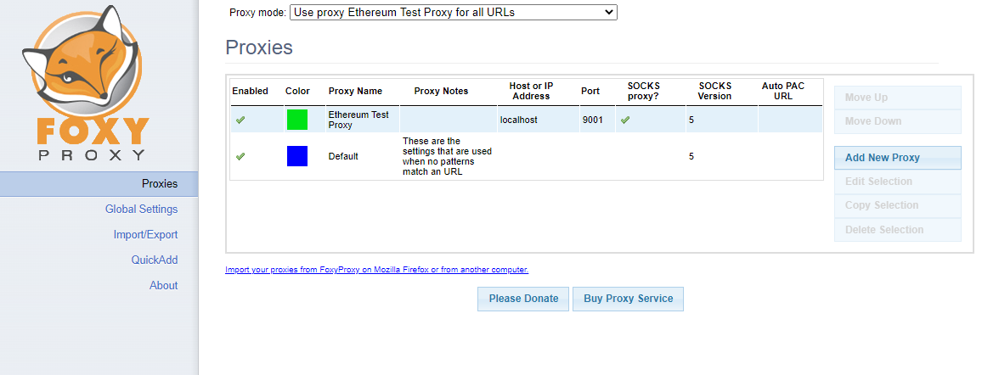

> 아래의 Stack Output 탭의 링크를 통해 Etheruem URL에 연결


### 4.10 Ethereum URL 접속
> ✔︎ EthStats

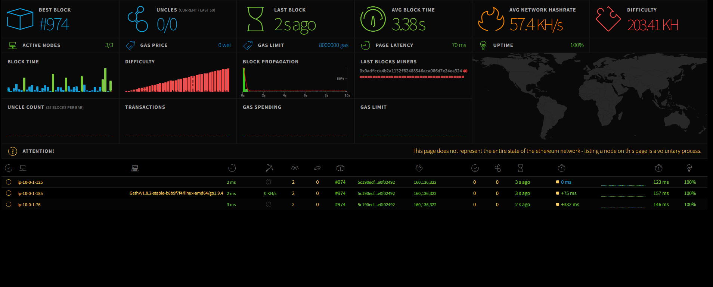
***
> ✔︎ EthExplorer

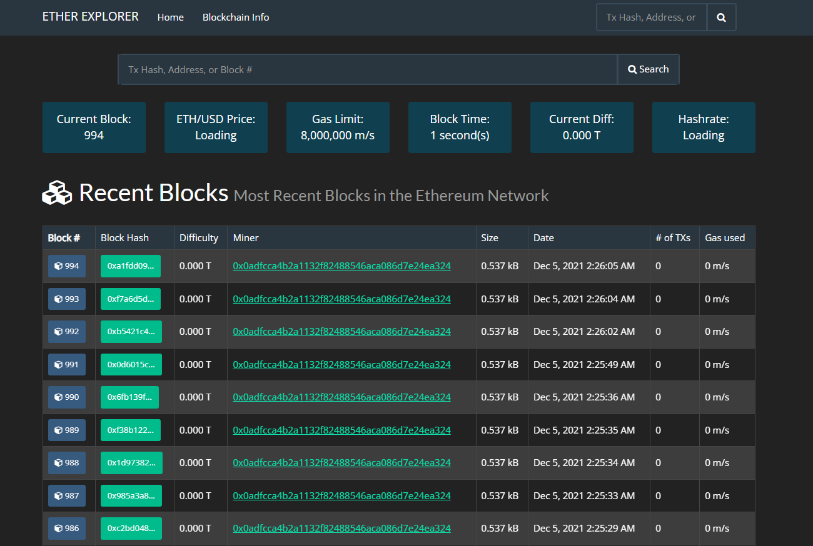

## 5. AWS Ethereum 네트워크에 DApp 이관 및 구동
### 5.1 Truffle HDWallet Provider Private Key 설치
```
$ npm install truffle-hdwallet-provider-privkey
```

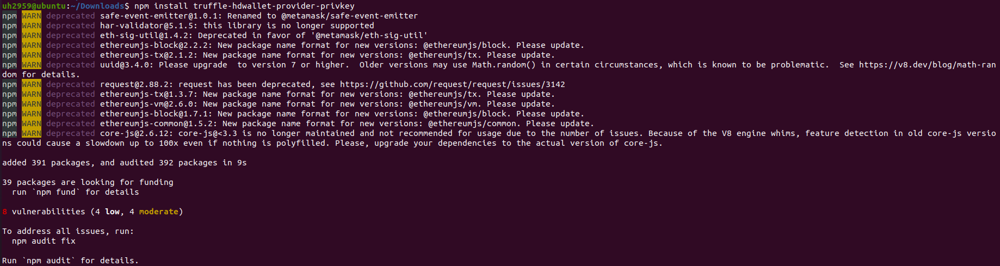

### 5.2 truffle-config.js 파일 수정
```
const HDWalletProvider = require("truffle-hdwallet-provider-privkey");
const privateKeys = ["afd2168f63635b5235cc8b4d69730faa4ffbea5cfcfab7b7d7625f91656e7d9f"]; //운영환경 Account의 Private Key

module.exports = {
  // See <http://truffleframework.com/docs/advanced/configuration>
  // for more about customizing your Truffle configuration!
  networks: {
    development: {
      host: "127.0.0.1",
      port: 8545,
      network_id: "*" // Match any network id
    },
    awsNetwork: {
        provider: () => {
            return new HDWalletProvider(privateKeys, "http://internal-TestN-LoadB-1OB27N8UWZK7E-955331309.us-west-2.elb.amazonaws.com:8545") //운영용 RPC URL
        },
        network_id: 1500,
        gas: 300000
    },
    develop: {
      port: 8545
    }
  }
};
```

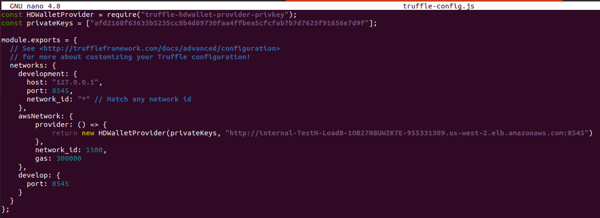

### 5.3 AWS Ethereum Blockchain Network에 Migration 하기
```
$ truffle migrate --network awsNetwork
```
